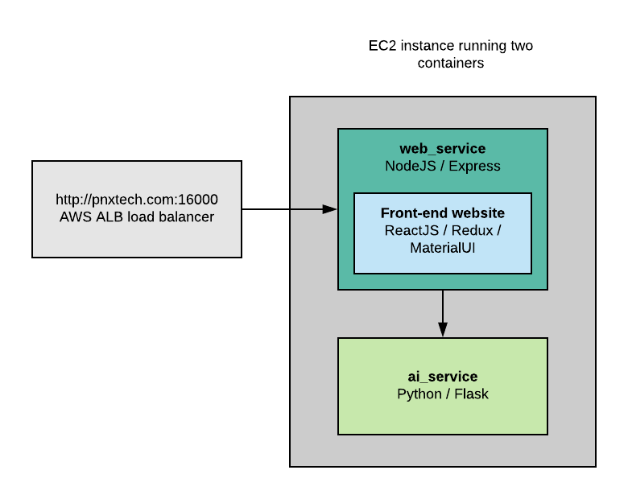
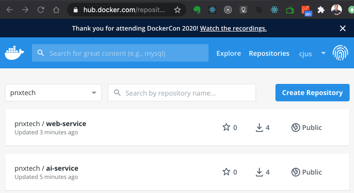

# skafos-test
Skafos Engineering Leadership Assessment and Test Project


## Project overview
This project closely follows the test description and project guidelines provided by [Ian](https://github.com/ianterrell) with the exception that I've chosen to use NodeJS/Express rather than Ruby/Rails due to my familiarity with the Node and JS stack.

I've structured the project as a deployable set of docker containerized services.  However, a live version is available at:
http://pnxtech.com:16000



The project consists of two containers.
* A `web-service` container which also includes the ReactJS front-end site
* and an `ai-service` container which hosts the Python/Flask service

The two docker images are publically host on my PnxTech Docker Hub account:



> Note: PnxTech is one of two GitHub/Docker/NPM accounts I own.  My cjus repo contains personal projects and PnxTech is more business oriented.

### Project source code
The `source` directory includes the following subfolders and each contains its own documentation.

* [ai-service](./source/ai-service/README.md): A Python Flask service exposing an API for Natural Language Processing.
* [front-end](./source/front-end/website/README.md): A ReactJS website to accept user input. The output from this site is copied into the web-service/public folder during deployement.
* [web-service](./source/web-service/README.md): NodeJS web service (using ExpressJS) which both serves the ReactJS site as well as accepts API calls from the ReactJS frontend app. Implemented APIs speak directly with the ai-service Python-based service.

## Test driving the deployed project
For ease of testing I've deployed the development stack described in this repo at: http://pnxtech.com:16000

## Local testing
In order to run this project locally, [Docker Desktop for Mac or Windows](https://www.docker.com/products/docker-desktop) is required.

The `docker-stack` directory includes a simple docker stack which easily launches containerized services.

To launch the stack:

```shell
$ cd docker-stack
$ ./stackup.sh
```

To tear-down the stack:

```shell
$ cd docker-stack
$ ./stackdown.sh
```
The container images are stored on my PnxTech Docker Hub repository as public images.

To access the local website point your web browser to: http://localhost:16000/

## Extra credit
After completing this project I decided to build a mobile app and short video walk through.

## Development Notes
To see how this project came together see the github commit history.
Note that I built this project while preping for other interviews and so the start and end times on the commit history do not reflect total focused time.

https://github.com/pnxtech/skafos-test/commits/master

