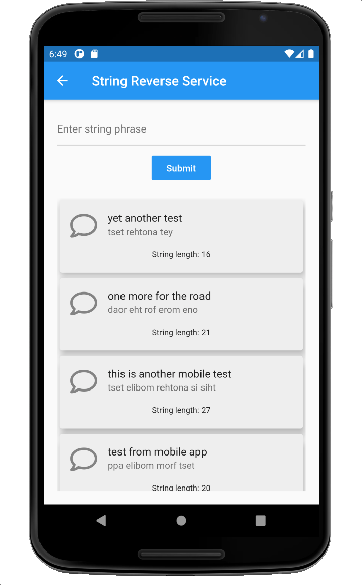

# skafos-test
Skafos Engineering Leadership Assessment and Test Project


## Project overview
This project closely follows the test description and project guidelines provided by [Ian](https://github.com/ianterrell) with the exception that I've chosen to use NodeJS/Express rather than Ruby/Rails due to my familiarity with the Node and JS stack.

My goal in completing this project has been to share my experiences with the following technologies:

* Containerized cloud-hosted microservices.
* Front-end web development involving HTML, CSS, JavaScript, ReactJS, Redux and Material Design.
* Python / Flask and NLTK.
* Mobile develpment using Flutter/Dart and Material Design.
* Modern application features such as Async/Await in JavaScript and Dart. Application state management in JavaScript and Dart.
* RESTful API construction - with the use of versioning.
* *nix shell scripting.
* Basic E2E (end to end) tests as shown in tests folders with shell scripts.
* HTTP network error handling.
* Experience using Github and Docker.
* Documentation authoring as illustrated in this repo.

I've structured this project as a deployable set of docker containerized services.  However, a live version is available at:
http://pnxtech.com:16000

The complete application is deployed on AWS as shown in this next diagram:


The project consists of two containers.
* A `web-service` container which also includes the ReactJS front-end site.
* An `ai-service` container which hosts the Python/Flask service.

Each container image is publically host on my PnxTech Docker Hub account:
> Note: PnxTech is one of two GitHub/Docker/NPM accounts I own.  My cjus repo contains personal projects and PnxTech is more business oriented.


### Project source code
This repo contains a `source` directory which includes the following subfolders. Each folder contains its own documentation.

* [ai-service](./source/ai-service/README.md): A Python Flask service exposing an API for string processing.
* [front-end](./source/front-end/): A ReactJS website to accept user input. The output from this site is copied into the web-service/public folder during deployement.
  * I've also added a Mobile app for extra credit.
* [web-service](./source/web-service/README.md): NodeJS web service (using ExpressJS) which both serves the ReactJS site as well as accepts API calls from the ReactJS frontend app. Implemented APIs speak directly with the ai-service Python-based service.

## Local testing
In order to run this project locally, [Docker Desktop for Mac or Windows](https://www.docker.com/products/docker-desktop) is required.

The `docker-stack` directory includes a simple docker stack which easily launches containerized services.

To launch the stack:

```shell
$ cd docker-stack
$ ./stackup.sh
```

To tear-down the stack:

```shell
$ cd docker-stack
$ ./stackdown.sh
```
The container images are stored on my PnxTech Docker Hub repository as public images.

To access the local website point your web browser to: http://localhost:16000/

## Extra credit
After completing this project I decided to build a mobile app.



The code for this app is included in the [front-end](./source/front-end/) folder.

## Development Notes
To see how this project came together see the github commit history.
Note that I built this project while preping for other interviews and so the start and end times on the commit history do not reflect total focused time.

https://github.com/pnxtech/skafos-test/commits/master

