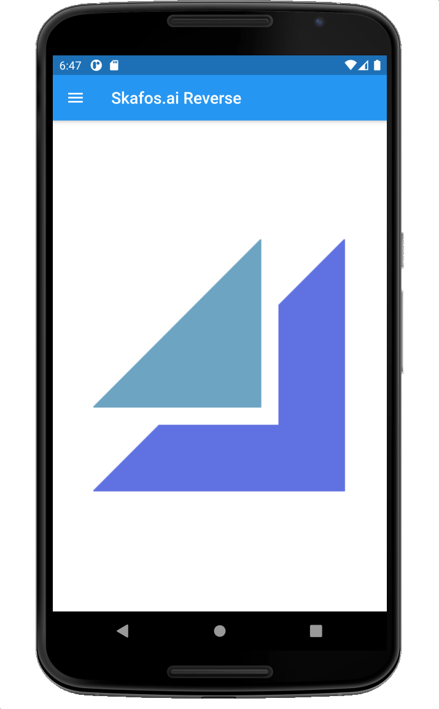
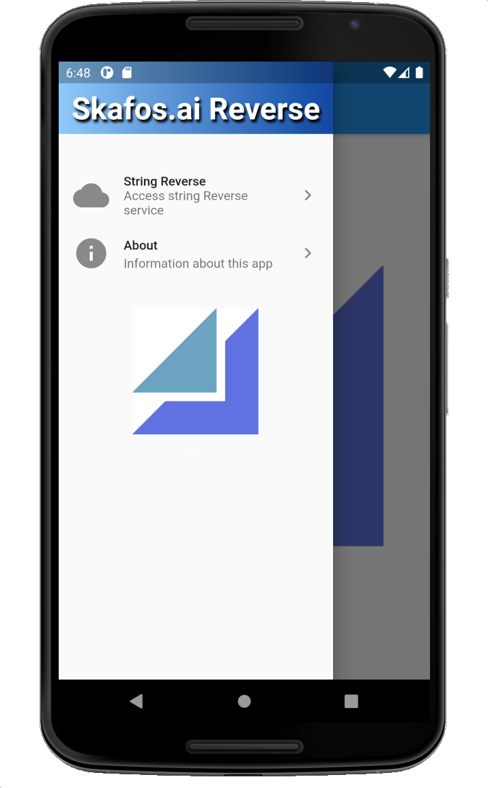
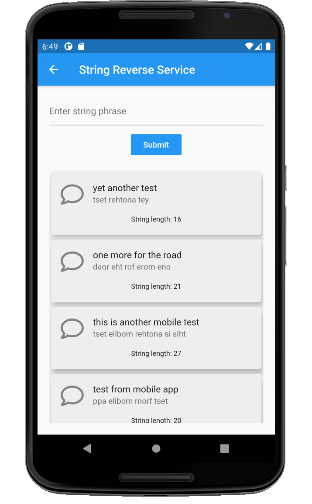

# mobile
A Flutter-based mobile app written in Dart.

This app wasn't part of the original requirements.  After completing the test project, testing it, and deploying it, I wanted to keep playing with it by creating a simple mobile app.

Like the ReactJS website this project uses both async/await and Google's Material UI.
However, unlike the ReactJS site, this simple app doesn't maintain state by efficiently adding to an internal store.

## Trying the app
The app will build from source on a machine setup with the Flutter SDK and Android Studio.  However, I've added an android .APK file here.

## Emulator screen captures

