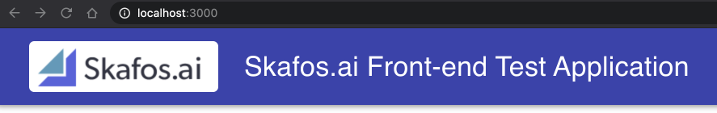
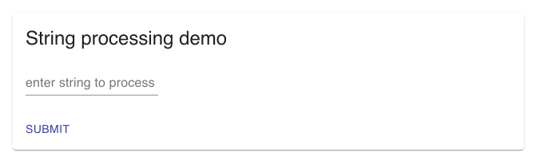

# website

This project was built using the [Create React App](https://github.com/facebook/create-react-app). I also installed the [material design UI library](https://material-ui.com/) for aesthetic value.
Additionally, I added Redux for state management.

## Running locally
Use `yarn start` to launch the website locally.
Open [http://localhost:3000](http://localhost:3000) to view it in the browser.

## Using the simple form
The displayed form allows for entering input and pressing the enter key to submit and using the submit button.  So the use of the submit button is optional if a return key is pressed.

## Updating the site
After making changes to the website run the `build-site.sh` script which calls `yarn build` (for a release build) and installs the built website into the web-service public folder.

