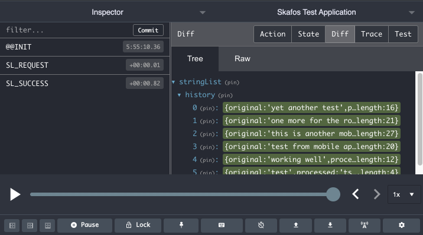

# website front-end

This project was built using the [Create React App](https://github.com/facebook/create-react-app). I also installed the [material design UI library](https://material-ui.com/) for aesthetic value.
Additionally, I added Redux for state management.

## Test driving the remote site
http://pnxtech.com:16000

## Running locally
Use `yarn start` to launch the website locally.
Open [http://localhost:3000](http://localhost:3000) to view it in the browser.

## Using the simple form
The displayed form allows for entering input and pressing the enter key to submit or simply using the submit button.  The use of the submit button is optional if a return key is pressed.

A history of entries is also shown in the Job history section along with a count of characters.

The webpage can be refreshed and restarted without impacting the job history because an API call is made by the site to the backend to retrieve a list of past jobs.  However, restarting the backend web server will clear the history as the data maintained isn't currently being persisted to a data store.

## Updating the site
After making changes to the website run the `build-site.sh` script which calls `yarn build` (for a release build) and installs the packaged website into the web-service public folder.

## Debugging using Redux DevTools
The site can be debugged using Redux DevTools:

> Note: for dev team review I've left this feature enabled but naturally it would be turned off in a production deployment.

## Improvement Notes
Given additional time or on an actual production project I would do the following:

- [ ] Refactor the use of JSX into additional components with their own props.
- [ ] Make use of MaterialUI's `makeStyles` and themes to minimize the amount of CSS files.
- [ ] Use [ImmutableJS](https://immutable-js.github.io/immutable-js/docs/#/) in the the reducers for cleaner handling of the application state.

